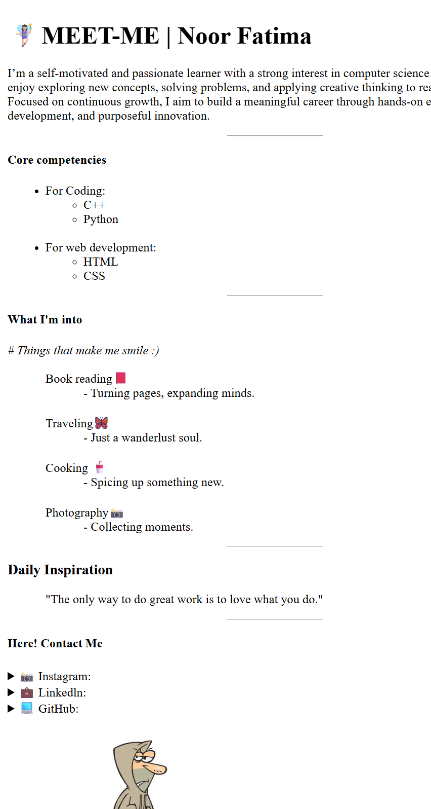

# Meet-Me 🌸

This is a small personal HTML project I created while practicing HTML.  
The page includes my introduction, skills, hobbies, and contact links.

## 📌 Project Overview
- Simple static profile page
- Built using pure **HTML5**
- Practice of different HTML tags, lists, forms, images, and links

## 📂 Features
- Introduction & short bio
- Core competencies list (coding & web development)
- Hobbies and personal interests
- Daily inspiration quote
- Contact links with icons
- Simple feedback form

## 🛠️ Tech Stack
- **HTML5**

## 📷 Preview
 <!-- Replace with your actual screenshot file name -->

## 🚀 How to View
1. Clone this repository:
   ```bash
   https://github.com/noorfattiimaa/Meet-Me.git
